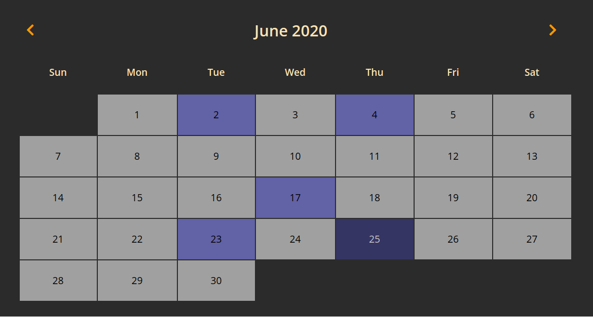
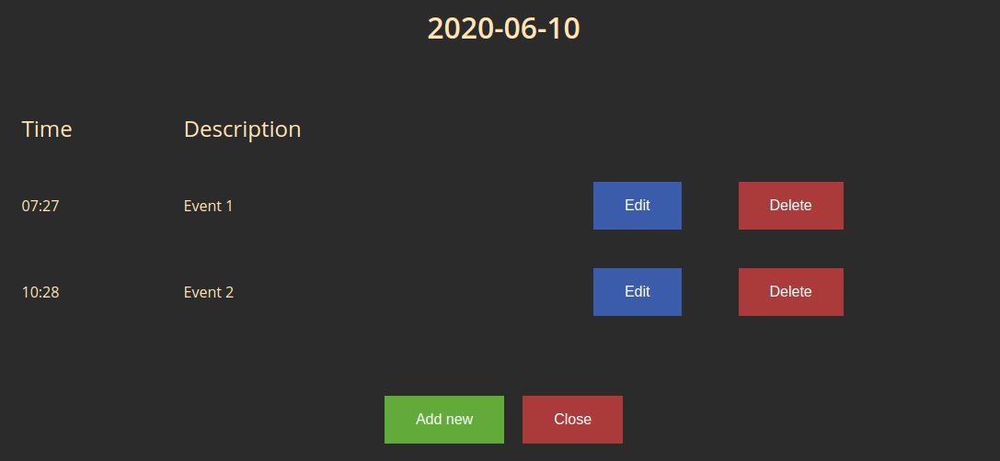
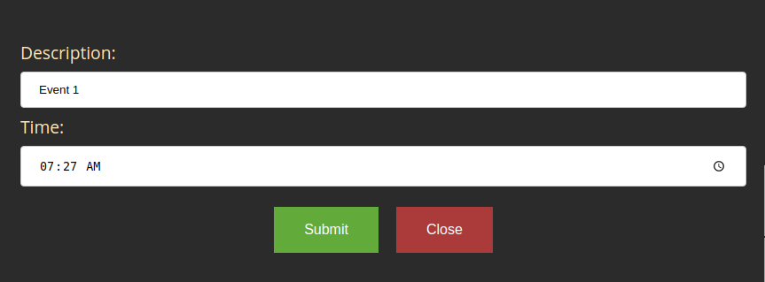

# Graphical-User-Interfaces
## Calendar with scheduler overview
The Project part of the GUI course consisted of making a calendar app with event scheduler using 3 technologies:
* desktop app using `C++ QT` framework,
* web app using `.NET Core MVC` framework,
* web app using `JS React` framework as frontend and `.NET Core` as backend API,
### Main view
In all of the approaches, the application contains a main view which is a calendar for current month. Current day is highlighted somehow and the background color of the busy days
(the days when an event is planned) is somehow distinct from all the regular days.  

### Day view  
Clicking on each day takes the user to day dialog in which all the events planned for given day are displayed with the possibility to either add new event, return to the main view by clicking
cancel, edit an existing event or delete an existing event.

### Event view
Adding a new event or editing an existing one is done using two input forms, one for text input and another one for time input.

